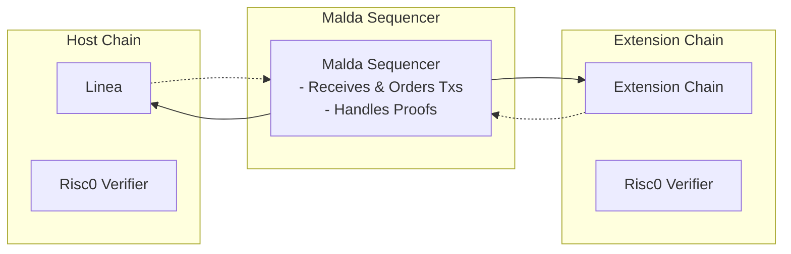
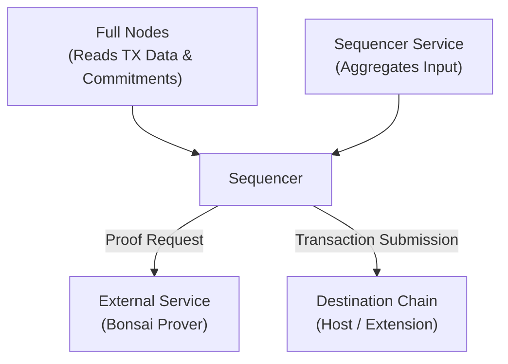
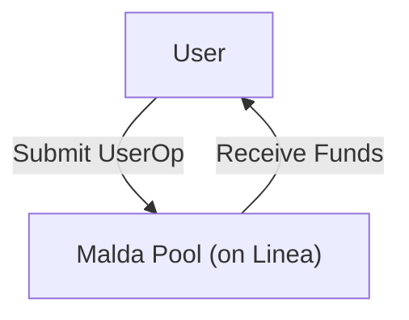
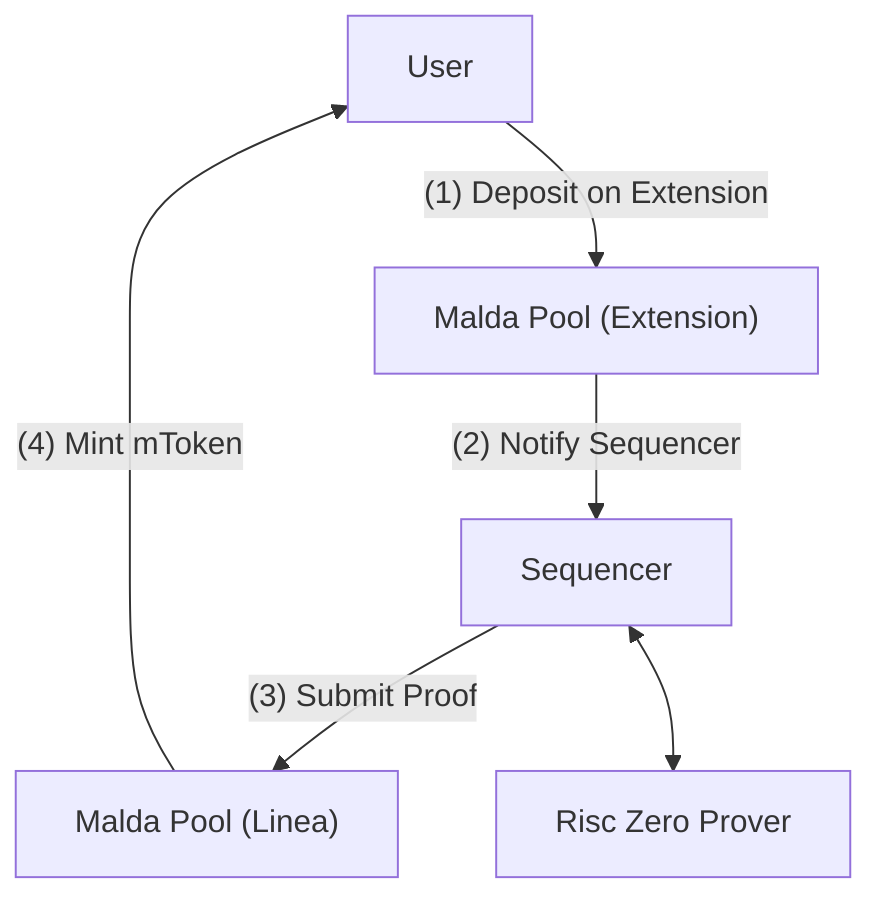
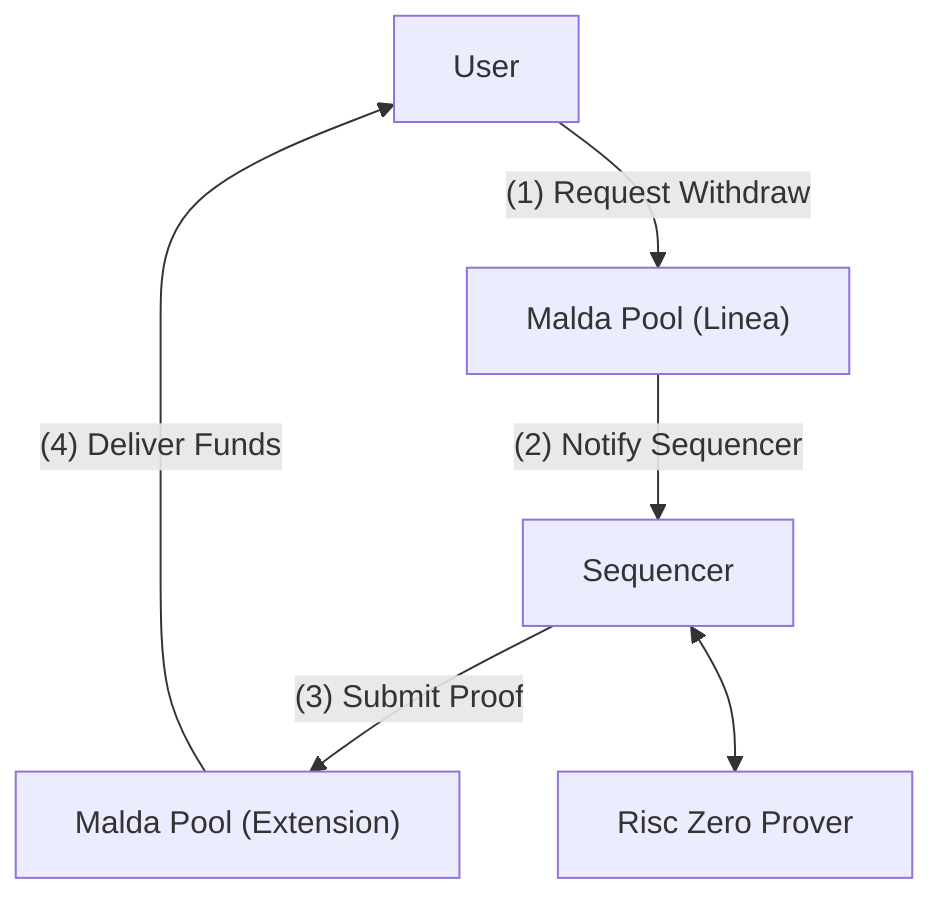

# malda-docs

# Introduction

Malda is a Unified Liquidity Lending protocol on Ethereum and Layer 2s,
delivering a seamless lending experience through global liquidity pools, all
secured by zkProofs.

Malda is the first DeFi protocol built fully on a zkCoprocessor technology to
create unified pools within the wider Ethereum ecosystem that act in sync to
provide uninterrupted money market services solving the problem of liquidity
fragmentation.

Over the next year Malda will be expanded into the next-gen lending protocol
that will use the power of zero-knowledge proofs to provide unparalleled
services via off-chain computations, but remain fully verifiable. We firmly
believe that future applications will only use blockchains as an anchor for
verified state but all computation will happen off-chain.

The next step in building the first truly scalable money market DeFi protocol is
to outsource all the interest rate and balance calculations into a zkVM. This
will enable us to do two major things:

- Fully customizable interest rate curves for users
- Scaling Ethereum
  - Our theoretical throughput can be calculated in the following way:
    - Currently: Mainnet TPS → L2 TPS → x100 via zkVM → Malda throughput
    - Changes introduced to each of the above component will increase Malda
      throughput exponentially

---

# Architecture

Malda introduces a Host Chain and Extension Chain architecture.

Linea as the host chain stores the full accounting and is the final ledger of
balances within the Malda protocol. Being a zk-rollup it is not subject to
reorgs from fraud proofs, with this zk-finality, Malda protocol can have a
consistent state even with integrating optimistic rollups.

Extension Chains do not contain protocol logic, but operate with zk-proofs.
Deposit transactions emit a zk-proof to Linea via the Sequencer, while withdraw
transactions require a valid zk-proof generated on the Malda state stored on
Linea.

The Malda Sequencer receives each order, generates a valid proof on the
transaction and delivers it to the destination (Host or Extension)

The last key piece for proof verification is the Risc0 Verifier contract
deployed on all supported chains. This is deployed and secured by the RiscZero
team and used by Malda contracts to verify the validity of our proofs.

### Self-Sequencing

Users have the ability to self-sequence the transactions for themselves, in case
of Sequencer failure or if they wish to do it for themselves.

Transactions requiring a proof (e.g. Extension chain transactions) can flag this
in the `lineaSelector` field, and the Malda sequencer will ignore the
transaction.

The user needs to generate the proof for themselves in this case by one of the
following method:

- Acquire an API key for Risc0 Bonsai service and request a proof
  - A detailed guide will be released with mainnet launch
- Submit the request to a prover network such as Boundless (expected to go live
  in 2025)
- Generate the proof on local machine. We have observed that a proof can be
  generated on a home computer as well, we are going to release guides and
  benchmarks with mainnet launch

Once they have received the proof they need to call the corresponding function
on either the host or the external chain.

We have a more detailed guide in the developer documentation on this.

Note: The most reliable and simple way for users to interact with Malda is to
rely on the sequencer. The sequencer does not have the ability to submit false
transactions, as each proof contains the required information for the user.

# End-user lifecycle

There are 3 types of transactions within Malda, under the hood they each have a
different lifecycle:

**1. Linea native transactions**

These transactions go through the same way as in a legacy lending protocol.

**2. Deposit type transaction from Extension**

We define Supply and Repay as deposit type of transactions, as both of them have
the same transaction flow from an architectural point of view. These are both
depositing funds to the extension pool contract and we verify those transactions
on the host chain to append the ledger.

**3. Withdraw type of transactions on Extension**

Borrowing and withdrawing are defined as withdraw type of transactions. These
are both requesting a withdrawal from the extension pools on Linea, and verify
that withdrawals are valid on the extension chain via the generated proof.

---

# Global Pools

Malda introduces a new design paradigm, which are global pools on Ethereum
Mainnet and its major rollups. In the Malda architecture a pool has multiple
components, `Market_Contract_onHost, Market_Contract_onExtensions` connected by
zero-knowledge proofs.

The protocol accounting is stored on Linea in the Host Contracts, but funds are
also stored on the Extension contract of each market. Withdrawal type of actions
(withdraw, borrow) cannot be executed without a verified zero-knowledge proof
securing the extension of the market. Deposit type of actions cannot be recorded
on the host chain without a valid zero-knowledge proof.

The advantage of this design is:

- Global supply, borrow, repay and withdraw on any of the supported chains
- Creating a single, global interest rate for assets based on the global
  utilization rate
- Removing fragmentation of supported assets across the different chains
  (LineaETH vs BaseETH)
- Deeper Liquidity and higher capital efficiency

---

# Use Cases

Malda has multiple new use cases and advantages compared to traditional
architecture:

- Ability to use 1 (!) money market as a DeFi bank to manage all investments
  through the major rollups of the Ethereum ecosystem
- Seamless arbitrage across chains with borrowed funds between DEXs
- Easy and convenient user-experience without needing to disrupt user flow to
  bridge between chains.
- Quick access to investment opportunity with the ability to borrow or withdraw
  on supported chains instantaneously.
- Easy migration and access for Ethereum Mainnet liquidity to major rollups
- Scale and Depth - Currently legacy lending models suffer fragmented liquidity
  and it is dependent on the underlying chain the quality of the service they
  can provide. Malda removes this limitation and provides the full depth of
  liquidity to all served markets, increasing capital efficiency and fostering
  meaningful economic growth in the Ethereum ecosystem.

---

# Global Interest Rates

Interest rates in Malda are calculated based on the global supply and global
borrow of each market.

We are using the following formula

$$
R_{\text{supply}} = \left(\left(1 + R_{\text{borrow}}\right)^{\frac{1}{\text{Blocks Per Year}}} - 1\right) \times \text{Total Borrowed} \times \left(1 - R_{\text{reserve}}\right) \div \text{Total Supply}
$$

$$
R_{\text{supply}}^{\text{(APY)}} = \left(1 + R_{\text{supply}}\right)^{\text{Blocks Per Year}} - 1
$$

Thanks to the unified global pool design users enjoy the same interest rates
across the wider Ethereum ecosystem, providing an excellent opportunity for
lenders and borrowers to access better interest rates without navigating between
the different L2s of Ethereum, with Malda being positioned as natural arbitrage
capturer.

---

# Rebalancing

The rebalancing module continuously monitors borrow activity on Malda and other
money markets, chains’ inflows and outflows, and additional metrics to forecast
future borrow demand per chain to rebalance token balances across chains.

The expected borrow demand for a token on a chain is forecasted based on a
linear regression of the borrow demand over the last 7 days. If forecasts are
shown to be inaccurate, other formulas will be used to minimize the observed
delta.

Additional signals include deviations in general borrow demand on other money
markets or outliers of chain inflows/outflows.

Based on that, each chain is assigned a weight defined as:

$$
\text{expected chain weight}_i = \frac{\text{expected borrow demand}_i}{\sum \text{expected borrow demand}_i}
$$

The available liquidity is then allocated according to the calculated chain
weights. A rebalancing is triggered when:

$$
\frac{\text{expected chain weight}_i}{\text{current chain weight}_i} > 1.2
$$

This acts as an initial benchmark which will be adjusted in the future based on
real-world data, optimizing for profitability. The liquidity is pulled from
chains with expected accessible liquidity. The system moves liquidity in a way
that minimizes:

$$
\sum \left| \text{expected chain weight}_i - \text{current chain weight}_i \right|
$$

Liquidity is bridged using intent based bridges like Across and Everclear for
security purposes. Aside from bridging fees, points/token rewards will be used
to create strong relationships with solvers.

In case of a token providing an official burn-and-mint bridge, Malda can make
use of it for protocol health. The reason for this is in case of a bug and
exploit in the burn-and-mint bridge the underlying token’s value will drop,
which means that the protocol does not take on additional trust assumptions.

---

# Global Accounts

Global Accounts in Malda are the first implementation of application specific
wallets proposed by Vitalik in a blog post recently.

The solution is fully wallet agnostic and after an initial set-up you will be
able to execute transactions across multiple chains with a single signature - no
need to switch and sign between chains.

Users can best access the protocol by setting up their global accounts in the
protocol on top of their existing wallets. This means that users will deposit
and receive funds in the wallets they have used previously, but they will have a
global method of interacting with the Malda protocol, eliminating the friction
of switching chains and paying gas fees

Under the hood of Global Accounts is a Delegator and a Delegate Smart Contract
Account (SCA) per chain for the user. Users can select which chains they wish to
have these SCAs set up within the Global Account.

Only the users' EOA can interact with the Delegate SCA, and the SCA can only
interact with the Malda application:

- The initial Delegator SCA only has the user’s EOA as a signer, while the
  Delegate SCA has the user’s passkey as a signer.
- The EOA gives permission to the Delegator SCA to spend their tokens.
- The Delegator delegates the right to interact with Malda to the Delegate SCA
  via Passkey.
- The Malda application uses passkey sign-in and signatures to execute the
  desired transactions on any of the supported chains.

---

# Future Roadmap Preview

### Scaling in the zkVM

Malda has the unique opportunity to continue scaling via outsourcing operations
to the zkVM.

Currently zkVM provides a 100x scaling from EVM, meaning we can do a 100 times
more calculations. As zero-knowledge technology is expected to exponentially
accelerate over the next years this will make Malda the most scalable DeFi
application.

The next major goal of Malda is to outsource all interest-rate calculations to
the zkVM. This will enable us to:

- Calculate interest rate distribution based on duration of deposits and
  borrows, favoring long-term depositors for their loyalty. This will not
  require lockups, maintaining the permissionless and free nature of DeFi
- Create use-case specific risk premiums for different strategies
- Compartmentalize risk for users based on their activity, behavior and
  preferences

This will enable Malda to operate in the most capital efficient way and serve as
the hub of DeFi activity for all types of users.

### Risk Management

For the next generation of DeFi protocols we need to take the next step and have
a fully programmable verified risk management module. Running the full modeling
behind risk management is not feasible on-chain, but zero-knowledge proofs and
zkML models will enable to move this to a fully verified environment.

Through our partners like RiscZero, Brevis, eOracle and others we are going to
be releasing the first decentralized and transparent risk management engine for
the Malda money market.

The Malda Risk Management model will be open-sourced for users to monitor and in
the future anyone can submit a proof to adjust the risk parameters to the
correct level.

---

# Security Properties

Zero-knowledge proofs are strong cryptographic building blocks for the future of
the internet. Since no party can generate a false proof, the primary security
consideration must be resistance to censorship.

In the initial stages of the protocol the user has the following choices:

- Trust our Sequencer to request and deliver the proof
  - Lowest latency option due to our access to a custom prover used only for
    Malda operations, and our optimized setup to access blockchain data through
    the Malda infra
- Request a Bonsai API key from Risc0 to have the ability to request and deliver
  the proof themselves
- Find a third party prover market that has the ability to generate the required
  proof
- Generate the proof themselves

Once Boundless reaches public mainnet the user will have the ability to directly
request proof through the decentralized prover network. The prover network is
decentralized to provide low pricing and high liveness, the proof is generated
by one prover.

---

# Contract Adresses

| Markets | Address                                    | Chains                |
| ------- | ------------------------------------------ | --------------------- |
| mUSDC   | 0x269C36A173D881720544Fb303E681370158FF1FD | Ethereum, Linea, Base |
| mWETH   | 0xC7Bc6bD45Eb84D594f51cED3c5497E6812C7732f | Ethereum, Linea, Base |
| mUSDT   | 0xDF0635c1eCfdF08146150691a97e2Ff6a8Aa1a90 | Ethereum, Linea, Base |
| mWBTC   | 0xcb4d153604a6F21Ff7625e5044E89C3b903599Bc | Ethereum, Linea, Base |
| mwstETH | 0x1D8e8cEFEb085f3211Ab6a443Ad9051b54D1cd1a | Ethereum, Linea, Base |
| mezETH  | 0x0B3c6645F4F2442AD4bbee2e2273A250461cA6f8 | Linea                 |
| mweETH  | 0x8BaD0c523516262a439197736fFf982F5E0987cC | Ethereum, Linea, Base |
| mwrsETH | 0x4DF3DD62DB219C47F6a7CB1bE02C511AFceAdf5E | Ethereum, Linea, Base |

| InterestModel           | Address                                    | Chains |
| ----------------------- | ------------------------------------------ | ------ |
| mUSDC JumpRateModelV4   | 0xe4165FA4231c0C41F71B93dB464e1f31937e3302 | Linea  |
| mWETH JumpRateModelV4   | 0x56310b8f82F3709B41aDf971ECC82F7e04E65Eea | Linea  |
| mUSDT JumpRateModelV4   | 0x74eb5ebCB998A227eAe8C2A5AaF594072da2100a | Linea  |
| mWBTC JumpRateModelV4   | 0x9B330aEA1A68BdE41fc81C1ba280098F09C969C3 | Linea  |
| mwstETH JumpRateModelV4 | 0xc552Cd2c7A4FE618E63C42438B1108361A568009 | Linea  |
| mezETH JumpRateModelV4  | 0x7574Fa32896Ece5b5127F6b44B087F4387344ef4 | Linea  |
| mweETH JumpRateModelV4  | 0x1f0C88a6FF8daB04307fc9d6203542583Db9F336 | Linea  |
| mwrsETH JumpRateModelV4 | 0xabEe4794832EaeaE25eE972D47C0ac540d8BBB2f | Linea  |

| Others                    | Address                                    | Chains                |
| ------------------------- | ------------------------------------------ | --------------------- |
| Deployer                  | 0xc781BaD08968E324D1B91Be3cca30fAd86E7BF98 | Ethereum, Linea, Base |
| Roles                     | 0x1211d07F0EBeA8994F23EC26e1e512929FC8Ab08 | Ethereum, Linea, Base |
| ZkVerifier                | 0xE32Fc580E6e3f6f5947BC2d900062DCe019F375f | Ethereum, Linea, Base |
| BatchSubmitter            | 0x04f0cDc5a215dEdf6A1Ed5444E07367e20768041 | Ethereum, Linea, Base |
| Operator                  | 0x05bD298c0C3F34B541B42F867BAF6707911BE437 | Linea                 |
| Pauser                    | 0xDdCca3eDa77622B7Ff5b7f11b340A8F818a87d2C | Ethereum, Linea, Base |
| Rebalancer                | 0x47F7749B80bA36F82EE7cfC29b3A5cb03eCC642c | Ethereum, Linea, Base |
| Connext bridge            | 0x1Fab79E6130C93a2AF11B2a5934589E003107c7c | Ethereum, Linea, Base |
| Everclear bridge          | 0x0be4Ad33E1B8835599857f5a8f110c3537D268A8 | Ethereum, Linea, Base |
| LayerZero bridge          | 0x9A4Ac70da21a3057Ee8f314C5640913578C7F2a7 | Ethereum, Linea, Base |
| Across bridge             | 0xF6697bfc708e202c4cF1694deDf1952e7B169b79 | Ethereum, Linea, Base |
| Referral                  | 0x05285E8E1B6D98bA33C5698795d2f60C2cA1Ef35 | Linea                 |
| TimelockController 1 day  | 0xBAE5457cadB08c242a63613724C1E10853c50C4A | Ethereum, Linea, Base |
| TimelockController 3 days | 0x742c6788f6903c4f3A9C792e5E799ba702C2FC97 | Ethereum, Linea, Base |
| TimelockController 7 days | 0xA00dFEE2d2c7A62EEe32d02CB0A4939A1679052E | Ethereum, Linea, Base |
| Oracle                    | 0x16f8668d7d650b494861569279E4F48D29C90fbD | Linea                 |
| Migrator                  | 0x71C873Ad208B8a69c83823579E2bC196655a8FCA | Linea                 |

---

# Oracles

Malda uses a dual archtecture of Api3 and eOracle feeds to secure its markets.

The oracle implementation contract can be found here:

[0x16f8668d7d650b494861569279E4F48D29C90fbD](https://lineascan.build/address/0x16f8668d7d650b494861569279E4F48D29C90fbD)

| Market         | Api3 Address                               | eOracle Address                            |
| -------------- | ------------------------------------------ | ------------------------------------------ |
| mUSDC          | 0x874b4573B30629F696653EE101528C7426FFFb6b | 0x6E4cda6DfFAB6b72682Bf1693c32ed75074905D9 |
| mUSDT          | 0x0c547EC8B69F50d023D52391b8cB82020c46b848 | 0x71BEf769d87249D61Edd31941A6BB7257d4bAE5F |
| mWBTC          | 0xa34Aa6654A7E45fB000F130453Ba967Fd57851C1 | 0xdEd5C17969220990de62cd1894BcDf49dC28583E |
| mwETH          | 0x2284eC83978Fe21A0E667298d9110bbeaED5E9B4 | 0x58B375D4A5ddAa7df7C54FE5A6A4B7024747fBE3 |
| mezETH         | 0x01600fE800B9a1c3638F24c1408F2d177133074C | 0x1C19C36926D353fD5889F0FD9e2a72570196B4EC |
| mweETH         | 0x6Bd45e0f0adaAE6481f2B4F3b867911BF5f8321b | 0xb71B0D0Bf654D360E5CD5B39E8bbD7CEE9970E09 |
| mrsETH/mwrsETH | 0xB7b25D8e8490a138c854426e7000C7E114C2DebF | 0xE6690E91d399e9f522374399412EbE04DA991315 |
| mwstETH        | 0x043F8c576154E19E05cD53b21Baab86deC75c728 | 0xB37568E6d24715E0C97e345C328f208dDbF8A7A9 |

# Audit Reports

Malda has been audited by Veridise, one of the most reputable auditors in the zk
space. They have previously audited Risc Zero, Linea, Scroll and Succinct among
others.

Link to audit reports in the Malda GH Repo

- [malda-lending report](https://github.com/malda-protocol/malda-lending/blob/main/audit/VAR_Malda_250120_malda_lending_V5.pdf)
- [malda-zk-coprocessor report](https://github.com/malda-protocol/malda-zk-coprocessor/blob/main/audit/VAR_Malda_250120_malda_zkcoprocessor.pdf)

Link to audit reports on their website:

- [malda-lending report](https://veridise.com/audits-archive/company/malda/malda-lending-2025-05-20/)
- [malda-zk-coprocessor report](https://veridise.com/audits-archive/company/malda/malda-zk-coprocessor-2025-05-20/)
